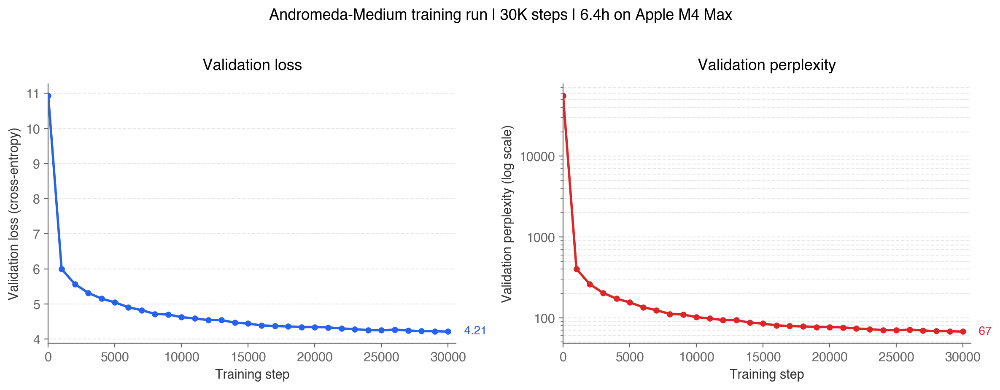

# Andromeda

A 63M parameter GPT-style language model, trained from scratch on a single laptop in 6.3 hours.

## What this is

Andromeda is a decoder-only transformer language model, built and trained entirely from scratch. No fine-tuning, no pre-trained weights — the model started from random initialisation and learned English from 246M tokens of web text over 30,000 training steps.

It's not a frontier model. It's deliberately small, trained on modest hardware, to demonstrate end-to-end competence across the full LLM pipeline: data ingestion, tokenisation, model architecture, training, inference, evaluation. Every component was written by hand in PyTorch.

This project is the production-scale counterpart to [Forge](https://github.com/SrihariSr/Forge), a from-scratch ML library I built. Forge demonstrated understanding of ML concepts by reimplementing them; Andromeda demonstrates the ability to implement an LLM from scratch.

## Technical highlights

- **Model**: 63.49M-parameter decoder-only transformer (12 layers, 8 heads, 512 embedding dim, 512 context length)
- **Training**: 30,000 steps of AdamW with warmup + cosine LR decay, gradient clipping, per-parameter-group weight decay
- **Architecture choices**: weight-tied embeddings, pre-norm residual blocks, GELU feed-forward, no biases in Linear/LayerNorm (LLaMA convention)
- **Data pipeline**: OpenWebText tokenised with GPT-2 BPE (tiktoken), parallelised across 12 CPU cores, memory-mapped binary files for zero-copy batch sampling
- **Training stability**: GPT-2-style residual projection initialisation scaled by 1/√(2 x n_layer) to prevent variance drift through deep residual streams
- **Inference**: top-k + top-p sampling with repetition penalty over a rolling 64 token window
- **Hardware**: Apple M4 Max with 14-core CPU, 32-core GPU, 36GB unified memory, MPS backend using PyTorch

## Results



**Final validation loss: 4.21** (perplexity 67) after 6 hours 21 minutes of training.

| Step   | Val loss | Perplexity |
|--------|----------|------------|
| 0      | 10.93    | 55,960     |
| 5,000  | 5.28     | 196        |
| 10,000 | 4.76     | 117        |
| 15,000 | 4.49     | 89         |
| 20,000 | 4.34     | 77         |
| 25,000 | 4.25     | 70         |
| 30,000 | **4.21** | **67**     |

For reference: a fully-trained GPT-2 Small (124M params, 40B tokens of training data) reaches perplexity ~17-24 on OpenWebText. Andromeda reaches a perplexity of 67 with half the parameters and ~1/160th of the training data.

### Training throughput

Sustained ~11,150 tokens/sec on an M4 Max throughout the 6-hour run. No divergence, no crashes, no thermal emergencies.

## Sample outputs

All outputs below are produced with `temperature=1.2, top_k=200, top_p=0.9, repetition_penalty=1.3`, unedited.

### News prompt

> **Prompt**: *"US senate vote"*
>
> **Output**: "US senate vote on Tuesday to make that happen without a debate.

Among these meetings is the House of Representatives’ majority leader, MOSA Director and Senate Majority Leader Mitch McConnell for president (Vt.) will run on special prosecutor general counsel Andrew Cuomo, before Republicans join in on December 1.

It's clear in the fact that they're going to face a series of challenges and ask what happens under oath or their decision-making? The first major problem is whether, during a debate last year, we saw what happened again that Democrats had set up an anti-imbridge bill, known as Raunteo, introduced to protect civil liberties protections of the city's African Americans while having direct control over white privilege in office and allowed him to challenge the matter.

The issues raised by many senators, especially congressional leaders, seem very likely and significantly below how the Senate goes about it (although some Democrats) that would oppose the GOP’s right to decide for President Barack Obama
"*

### Corporate PR prompt

> **Prompt**: *"A spokesperson for the company said"*
>
> **Output**: *"A spokesperson for the company said on Tuesday that three schools have "a clear concerns about a candidate coming through this matter."

“We take any available information as such and we hope to complete it for publication. This change will ensure all students can provide a benefit while continuing with our school year-end experience to evaluate that decision,” Yutay says. The department doesn't want anyone to attend and ask anything because they aren’t ready to begin the first major program at M.A.N., or he plans to leave his office on March 1 after the election.

His calls for his wife to submit a series of meetings to all school officials, including Kaley Sisler & Sam Smith in both India and England; said she will provide "a unique message". Mr Smith said the four schools have been receiving good interest, when school authorities cannot move ahead with student support.

Kaley Sisler has come up in 2013 and recently invited members for a major committee"*

### Narrative prompt

> **Prompt**: *"Once upon a time"*
>
> **Output**: *"I could easily see how the weather was going on in New York. The rain, too, had been about two-and-a-half miles south of New York City. That meant that people would be walking out to the mountains to get a place off the ground and all that was there were huge roads."*

First-person narrative with spatial reasoning (cardinal directions, distance measurements). OpenWebText has relatively little fairy-tale content, so the model defaulted to the most common first-person genre in its training data.

## Failure modes

Being honest about where the model fails is as important as showing where it succeeds.

### Semantic inconsistency
The model produces grammatical sentences with contradictory or nonsensical content. *"The capital of France is a small, huge, massive-scale and complex city"* — every word is a plausible English word, every pair flows grammatically, but the sentence is meaningless. This is the expected failure mode of an undertrained language model that has learned phrase shapes without learning what they refer to.

### Topic drift over long generations
Samples that start on one topic often migrate to another after 50-100 tokens. This reflects the 512-token context window and limited training data — the model has learned what different genres look like locally but hasn't seen enough text to learn *when* to switch.

### Fragile factual retrieval
Simple factual questions fail unpredictably. Prompted with "The capital of France is", the model produces generic news-about-France output without ever confidently emitting "Paris". World knowledge requires orders of magnitude more training data than this model received.

### Repetition without safeguards
Without the repetition penalty, low-temperature generation collapses into loops (e.g. "the crisis has been a major problem ..." × 20). The repetition penalty applied to the last 64 tokens eliminates this almost entirely. This is a known failure mode of small LMs and a well-understood problem with a standard solution.

## Architecture

```
Input tokens (B, T)
    │
    ├─> Token Embedding (50,257 × 512)
    └─> Positional Embedding (512 × 512)
        │
        V
    [Transformer Block] × 12
    │
    │  ┌──────────────────────────────────┐
    │  │ x = x + MultiHeadAttn(LN(x))     │   <- pre-norm residual
    │  │ x = x + FeedForward(LN(x))       │
    │  │                                  │
    │  │  MultiHeadAttn: 8 heads x 64 dim │
    │  │  FeedForward:  512 -> 2048 -> 512│
    │  │                  with GELU       │
    │  └──────────────────────────────────┘
    │
    V
Final LayerNorm
    │
    V
Language-model head (weight-tied to embedding)
    │
    V
Logits (B, T, 50,257)
```

## Training setup

| Hyperparameter         | Value             |
|------------------------|-------------------|
| Optimiser              | AdamW             |
| Betas                  | (0.9, 0.95)       |
| Weight decay           | 0.1 (matrices only) |
| Peak learning rate     | 3e-4              |
| Min learning rate      | 3e-5              |
| Warmup steps           | 600               |
| Total steps            | 30,000            |
| LR schedule            | Linear warmup + cosine decay |
| Gradient clipping      | 1.0 (L2 norm)     |
| Batch size             | 16 sequences      |
| Sequence length        | 512 tokens        |
| Effective tokens/step  | 8,192             |
| Total tokens seen      | 245,760,000       |

Validation loss evaluated every 1,000 steps on 50 randomly-sampled batches from a held-out split.


## How to run

```bash
# Set up
python3.12 -m venv venv && source venv/bin/activate
pip install -r requirements.txt

# Prepare data (downloads OpenWebText, tokenises in parallel)
python -m data.download

# Train
python -m training.train

# Generate
python -m evaluate.generate \
    --ckpt checkpoints/medium/best.pt \
    --prompt "The future of" \
    --temperature 1.2 --top_k 200 --top_p 0.9 --repetition_penalty 1.3
```

Built by [Srihari](https://github.com/SrihariSr), 2026.