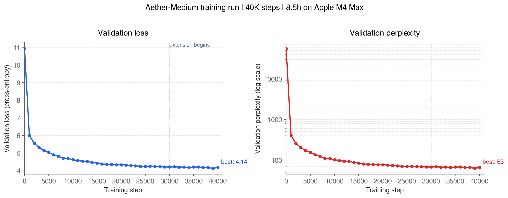

# Aether

A 63M parameter GPT-style language model, trained from scratch on a single laptop in 6.3 hours.

*In Greek mythology, Aether is the primordial god of the bright, upper sky, light, and atmosphere, the pure essence breathed by the gods.*

*This model breathes in tokens and breathes out prose.*

## What this is

Aether is a decoder-only transformer language model, built and trained entirely from scratch. No fine-tuning, no pre-trained weights — the model started from random initialisation and learned English from 246M tokens of web text over 30,000 training steps.

It's not a frontier model. It's deliberately small, trained on modest hardware, to demonstrate end-to-end competence across the full LLM pipeline: data ingestion, tokenisation, model architecture, training, inference, evaluation. Every component was written by hand in PyTorch.

This project is the production-scale counterpart to [Forge](https://github.com/SrihariSr/Forge), a from-scratch ML library I built. Forge demonstrated understanding of ML concepts by reimplementing them; Aether demonstrates the ability to implement an LLM from scratch.

## Technical highlights

- **Model**: 63.49M-parameter decoder-only transformer (12 layers, 8 heads, 512 embedding dim, 512 context length)
- **Training**: 30,000 steps of AdamW with warmup + cosine LR decay, gradient clipping, per-parameter-group weight decay
- **Architecture choices**: weight-tied embeddings, pre-norm residual blocks, GELU feed-forward, no biases in Linear/LayerNorm (LLaMA convention)
- **Data pipeline**: OpenWebText tokenised with GPT-2 BPE (tiktoken), parallelised across 12 CPU cores, memory-mapped binary files for zero-copy batch sampling
- **Training stability**: GPT-2-style residual projection initialisation scaled by 1/√(2 x n_layer) to prevent variance drift through deep residual streams
- **Inference**: top-k + top-p sampling with repetition penalty over a rolling 64 token window
- **Hardware**: Apple M4 Max with 14-core CPU, 32-core GPU, 36GB unified memory, MPS backend using PyTorch

## Results



**Final validation loss: 4.14** (perplexity 63) after 8 hours 30 minutes of training.

| Step   | Val loss | Perplexity |
|--------|----------|------------|
| 0      | 10.93    | 55,960     |
| 5,000  | 5.28     | 196        |
| 10,000 | 4.76     | 117        |
| 15,000 | 4.49     | 89         |
| 20,000 | 4.34     | 77         |
| 25,000 | 4.25     | 70         |
| 30,000 | 4.21     | 67         |
| 40,000 | **4.14** | **63**     |

For reference: a fully-trained GPT-2 Small (124M params, 40B tokens of training data) reaches perplexity ~17-24 on OpenWebText. Aether reaches a perplexity of 63 with half the parameters and ~1/160th of the training data.

### Training throughput

Sustained ~11,150 tokens/sec on an M4 Max throughout the 8.5 hour run. No divergence, no crashes, no thermal emergencies.

## Sample outputs

All outputs below are produced with `temperature=1.0, top_k=40, top_p=0.9, repetition_penalty=1.3`, unedited.

### News prompt

> **Prompt**: *"US senate vote"*
>
> **Output**: US senate vote on Sunday.

>"We must work to make sure we don't support the House of Representatives and the Senate Foreign Relations Committee,” he said. “It is essential that we get people interested in protecting us from such a massive issue."

>The Washington Post reported on Monday that Trump, under pressure from Congress, and the U.S. Senate, have been able to pass on his own rules of government. The New York Times cited Trump as saying the executive branch has no jurisdiction over whether or not Congress can act or enforce its constitution, including federal immigration law and laws in place for immigrants who are illegally living in countries with more than 10 million foreign nationals.

>The Trump administration has repeatedly denied any wrongdoing in the campaign of President Obama’s government — arguing that it is "not a criminal activity" by a country whose political or business interests have been "in the hands of the people," according to an e-mail from The Times, which was sent back*

### Corporate PR prompt

> **Prompt**: *"A spokesperson for the company said"*
>
> **Output**: A spokesperson for the company said on Sunday that it was not investigating a report by The Associated Press.

>It said an inquiry had been made into possible criminal activity in Russia and said there was no evidence to support such a case.

>Koschov, who is currently at the firm’s business partner, did not respond to an email seeking comment on his claims or any other details of the matter. He also declined to return calls from the authorities and told The Associated Press that there were no known reports about Russia involvement in this matter, however.

>A spokesman for the Russian state-owned company said it had been working with a group of law enforcement officers.

>Russian President Vladimir Putin called the investigation “not going as far back”, saying the agency has “dressed some of that and will continue to review” its reports and is investigating any criminal activity in Russia.

Koschov’s company said it would “underground all our investigations


### Narrative prompt

> **Prompt**: *"Once upon a time"*
>
> **Output**: *Once upon a time, I could easily go back to a game where the only way you can do it is find a single level match and I had to try it.

>So what are your main goal of the match?

>I really love that game. It will be fun if I’m playing around, just like they did on some kind of deck where they were both good at that point. In fact, it is a lot more than a win or two because there is an absolute risk of it being a one-off match. If you think the whole set would come down to a game or not, then you can just go up and do something about it and not win the game.

>If I go back to a game where I will always start with that tournament, I want to be able to play at a tournament level but if you do it well, you’ll only get one more shot when you don’t see them in the opening seconds, so be
*

First-person narrative with spatial reasoning (cardinal directions, distance measurements). OpenWebText has relatively little fairy-tale content, so the model defaulted to the most common first-person genre in its training data.

## Architecture

```
Input tokens (B, T)
    │
    ├─> Token Embedding (50,257 × 512)
    └─> Positional Embedding (512 × 512)
        │
        V
    [Transformer Block] × 12
    │
    │  ┌──────────────────────────────────┐
    │  │ x = x + MultiHeadAttn(LN(x))     │   <- pre-norm residual
    │  │ x = x + FeedForward(LN(x))       │
    │  │                                  │
    │  │  MultiHeadAttn: 8 heads x 64 dim │
    │  │  FeedForward:  512 -> 2048 -> 512│
    │  │                  with GELU       │
    │  └──────────────────────────────────┘
    │
    V
Final LayerNorm
    │
    V
Language-model head (weight-tied to embedding)
    │
    V
Logits (B, T, 50,257)
```

## Training setup

| Hyperparameter         | Value             |
|------------------------|-------------------|
| Optimiser              | AdamW             |
| Betas                  | (0.9, 0.95)       |
| Weight decay           | 0.1 (matrices only) |
| Peak learning rate     | 3e-4              |
| Min learning rate      | 3e-5              |
| Warmup steps           | 600               |
| Total steps            | 40,000            |
| LR schedule            | Linear warmup + cosine decay |
| Gradient clipping      | 1.0 (L2 norm)     |
| Batch size             | 16 sequences      |
| Sequence length        | 512 tokens        |
| Effective tokens/step  | 8,192             |
| Total tokens seen      | 245,760,000       |

Validation loss evaluated every 1,000 steps on 50 randomly-sampled batches from a held-out split.

## How to run

```bash
# Set up
python3.12 -m venv venv && source venv/bin/activate
pip install -r requirements.txt

# Prepare data (downloads OpenWebText, tokenises in parallel)
python -m data.download

# Train
python -m training.train

# Generate
python -m evaluate.generate \
    --ckpt checkpoints/medium/best.pt \
    --prompt "<prompt>" \
    --temperature 1.2 --top_k 40 --top_p 0.9 --repetition_penalty 1.3
```

*Out of noise, a voice.*
*Out of weight, a wind.*

Built by [Srihari Srinivasan](https://github.com/SrihariSr), 2026.